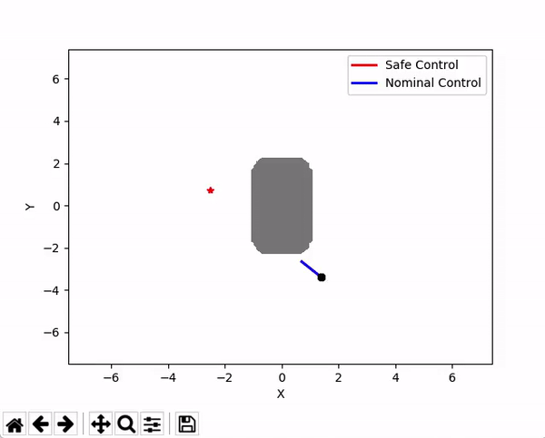

# cbf_quadrotor


Control Barrier Functions (CBFs) for Quadrotors. Work in progress. Based on [hocherie/2d_grid_playground](https://github.com/hocherie/2d_grid_playground) for dynamics simulator, nominal controllers, range sensing.
Includes following files:

* **`main.py`**: Simple example on using `simulator.py`, `controller.py` and `dynamics.py`. Quadrotor maneuvering in 2D grid with 2nd order dynamics executing naive safe control.

* **`ecbf_quadrotor.py`**: CBF implementation in `ECBF_CONTROL()` class: Exponential Control Barrier Function. Run to show quadrotor with control barrier function enabled for safe control.

* **`dynamics.py`**: Contains QuadDynamics class which gives a simple 3d quadrotor dynamics given 2nd order equations of motion. Use by instantiating class `dyn=QuadDynamics()` and calling `self.step_dynamics(state, u)` to update quadrotor state. Based on http://andrew.gibiansky.com/downloads/pdf/Quadcopter%20Dynamics,%20Simulation,%20and%20Control.pdf

* **`controller.py`**: Controller-related functions. Uses cascaded PID controllers. (ex. Position, Velocity, Attitude Controller). Mainly use by calling `go_to_position(...)`, `go_to_acceleration(...)`.

* **`sim_utils.py`**: Common utility functions for simulator and dynamics. Ex. `get_rot_matrix(angles)`

* **`visualize_dynamics.py`**: Contains graphing-related functions for dynamics.py. Mainly use for tuning PID controllers.

* **`simulator.py`**: (Unused by CBF files) Creates 2D grid simulator and enables basic range sening. Contains Map class (create from txt file), Robot class (stores current and paast state, also instantiates QuadDynamics object). 

* **`evaluate.py`** : (Unused by CBF files) Contains functions to evaluate safe control methods. 

## Getting Started 

### Installation

```
git clone https://github.com/hocherie/cbf_quadrotor.git     # Clone Repo
cd cbf_quadrotor                  # Navigate to folder
conda env create -f py3_env.yml  # Install Environment
conda activate py3_cbf
```
### Play with Control Barrier Function Safe Control
`$ python ecbf_quadrotor.py`


Robot uses Exponential Control Barrier Functions to stay safe with respect to single obstacle at center. Minimum interventional safe control (uses control with least difference to nominal while staying safe). Uses dynamics and controllers to move.
Originally given straight input to goal (red star).


### Play with Quadrotor Dynamics
`$ python dynamics.py`


Robot moves to desired position. (set in `main()`)
Uses dynamics from second order equations of motion (acceleration, torque) from `dynamics.py`, and cascaded PID controllers for position, velocity, and dynamics inversion (check?) to compute final motor input from `controller.py`.

Code first generates trajectory then visualizes.

### Play with 2D Grid Simulator
`$ python main.py`


Robot executes naive safe control to stay safe in 2D obstacle environment given range measurements. Calculates opposing vector to closest obstacle to repulse away. Uses dynamics and controllers to move.
Originally given straight input.


# TODO
- [x] add ecbf to README
- [ ] update conda yml file
- [ ] rename conda environment
- [x] Start with GIF
- [x] Update README.md with new screen capture of single-robot ECBF
- [ ] Update installation instructions
- [ ] Split CBF functions from run file
- [ ] Split single robot File and multi-robot file
- [ ] Comment all functions
- [ ] Add multi-robot ECBF (MM)
- [ ] Links to reference papers 

# Author
Cherie Ho (cherieh@cs.cmu.edu)

Mohammadreza Mousaei (mmousaei@andrew.cmu.edu)

Kate Shih (kshih@andrew.cmu.edu)
