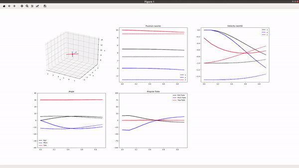
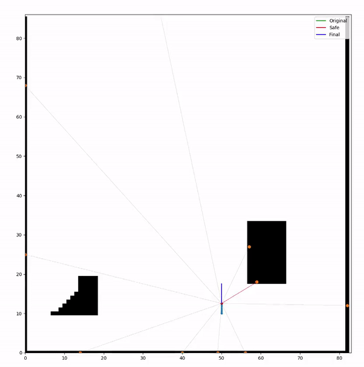

# 2d_grid_playground
2D Grid Environment with common utils (raytracing) and quadrotor dynamics for quick prototyping. Includes following files:

* `main.py`: Simulates quadrotor maneuvering in 2D grid with 2nd order dynamics executing naive safe control.

* `sim_utils.py`: Contains common utility functions for simulator. Ex. `get_rot_matrix(angles)`

* `simulator.py`: Creates 2D grid simulator and enables basic range sening. Contains Map class (create from txt file), Robot class (stores current and paast state, also instantiates QuadDynamics object)

* `evaluate.py` : Contains functions to evaluate safe control methods.

* `controller.py`: Controller-related functions for quadrotor cascaded control. (ex. Position, Velocity, Attitude Controller). Mainly use by calling `go_to_position(state, des_pos, param_dict)`.

* `dynamics.py`: Contains QuadDynamics class which gives a simple 3d quadrotor dynamics given 2nd order equations of motion. Use by instantiating class and calling `self.step_dynamics(state, u)` to update quadrotor state. Based on http://andrew.gibiansky.com/downloads/pdf/Quadcopter%20Dynamics,%20Simulation,%20and%20Control.pdf

* `visualize_dynamics.py`: Contains graphing-related functions for dynamics.py. Mainly use for tuning PID controllers.

## Getting Started 

### Installation
1. Clone repo. 

`git clone https://github.com/hocherie/2d_grid_playground.git`

2. Navigate to folder.

`cd 2d_grid_playground`

3. Create conda environment from yml file.

`conda env create -f py37_env.yml`

### Play with Quadrotor Dynamics
`python dynamics.py`

Robot moves to desired position. (set in `main()`)
Uses dynamics from second order equations of motion (acceleration, torque) from `dynamics.py`, and cascaded PID controllers for position, velocity, and dynamics inversion (check?) to compute final motor input from `controller.py`.

Code first generates trajectory then visualizes.

### Play with 2D Grid Simulator
`python main.py`

Robot executes naive safe control to stay safe in 2D obstacle environment given range measurements. Calculates opposing vector to closest obstacle to repulse away. Uses dynamics and controllers to move.
Originally given straight input.

# Author
Cherie Ho (cherieh@cs.cmu.edu)
